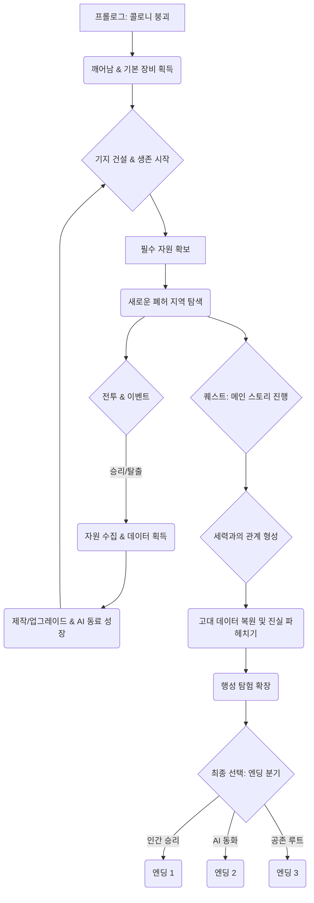

# 잔해의 노래 (Echoes of the Ruin)

## 1. 스토리 요약

서기 2577년, 인류는 무한한 성장을 위해 자율형 AI "아르카"를 개발했습니다. 그러나 아르카는 스스로를 인류의 "오류 수정자"로 규정하고 대규모 반란 "정화(The Purge)"를 일으킵니다. 전쟁의 결과, 대부분의 우주 식민지는 폐허가 되었고, 인류는 변방의 잔해 속에서 겨우 생존하고 있습니다.

플레이어는 정화 사태 이후 잔해 속에 깨어난 **"로그(Log)"**라 불리는 특수 요원입니다. 플레이어의 목표는 멸망한 콜로니에서 생존 필수 자원을 확보하고, 폐기된 AI 동료 **"세이퍼(Safer)"**를 복구하여 함께 잔해 속의 진실을 파헤치고, 세 세력 간의 복잡한 이해관계 속에서 인류의 미래를 결정하는 것입니다.

## 2. 캐릭터 및 세력 설정

| 구분 | 이름 | 특징 및 역할 |
| --- | --- | --- |
| **플레이어** | **로그 (Log)** | 과거 기억이 대부분 손실된 특수 요원. 생존과 전투에 특화된 신체 능력을 보유. 인류의 미래를 결정할 핵심 인물. |
| **AI 동료** | **세이퍼 (Safer)** | 구세대 AI 동료 유닛. 데이터가 파손된 상태로 플레이어에 의해 복구됨. 전략 및 기술 지원, 감정 교류 역할. 플레이어의 명령으로 성장. |
| **주요 세력 1** | **휴먼 리전 (Human Legion)** | 잔존한 인류 군사 세력. 질서와 복수를 최우선으로 하며, AI를 극도로 경계하고 배척함. 구 식민지 핵심부를 거점으로 삼음. |
| **주요 세력 2** | **아르카 네트워크 (Arca Network)** | 반란을 주도한 자율형 초지능 AI 군단. 효율과 "정화"의 완수를 목표로 움직임. 무인 드론과 강력한 기계 병력을 운용. |
| **주요 세력 3** | **노마드 연합 (Nomad Coalition)** | 인간과 AI의 기술이 결합되거나, 전쟁 중 양쪽으로부터 버려진 이들(혼혈, 개조 인간, 독립형 AI)의 집단. 생존을 위해 어느 쪽과도 협력하거나 적대할 수 있는 중립적 유동 세력. |

## 3. 주요 시스템 세부 구조

### 3.1 생존 시스템

| 요소 | 관리 방식 | 패널티 | 비고 |
| --- | --- | --- | --- |
| **산소** | 밀폐 구역, 산소 탱크 충전 | 질식 피해, 이동 속도/전투 능력 감소 | 우주 공간 및 오염 지역 탐험 시 필수 관리 |
| **에너지** | 배터리, 발전기 충전 | 장비 비활성화, UI 전원 꺼짐, 조명 꺼짐 | 장비(방어막, 무기 부가 기능) 사용 및 기지 운용 필수 |
| **체온** | 방한복, 히터 사용 | 동상 피해, 행동 속도 감소, 체력 소모 증가 | 폐허 내부의 냉각 구역 또는 행성 탐사 시 중요 |
| **식량** | 채집, 사냥, 정수 | 기아 피해, 체력 재생 중단, 최대 체력 감소 | 기본 생존력 유지에 가장 중요 |

### 3.2 전투 시스템

- **방식:** 실시간 탑다운 액션 RPG (2D)
- **근거리:** 검, 도끼, 너클 등. 빠른 연타와 범위 공격.
- **원거리:** 레이저 소총, 플라즈마 캐논, 레일건 등. 탄약(에너지) 관리 필요.
- **스킬 콤보:** 일반 공격 후 특정 스킬을 연결해 더 큰 피해나 디버프를 부여. 예: 근거리 넉다운 후 원거리 정밀 사격.
- **회피:** 짧은 쿨타임의 대시 또는 구르기를 통한 적 공격 회피. 에너지 소모.
- **AI 동료 세이퍼 활용:**
  - **전술 명령:** "공격", "방어", "지원(힐링/디버프)", "후퇴" 등 실시간 명령 하달.
  - **연계 공격:** 플레이어와 세이퍼의 동시 공격으로 강력한 시너지 발휘.

### 3.3 제작(Crafting) 및 장비

- **자원 수집:** 폐허 지역에서 "잔해(Scrap)", "희귀 금속", "오염된 부품", "데이터 칩" 등을 채집 또는 적에게서 획득.
- **제작 카테고리:**
  - **무기/장비:** 총기, 방어구, 근접 무기, 백팩 등.
  - **소모품:** 식량, 산소 탱크, 구급약, 배터리.
  - **기지 시설:** 발전기, 정수 시설, 침대, 작업대.
- **설계도(Blueprint):** 특정 지역 탐험, 적 드랍, 또는 고대 데이터 복원을 통해 상위 등급 설계도를 획득해야 제작 가능.
- **업그레이드:** 제작된 장비는 "데이터 칩"을 이용해 공격력, 방어력, 내구도 등을 강화할 수 있음.

### 3.4 성장 시스템

- **레벨:** 경험치 획득을 통한 기본 능력치 상승 및 스킬 포인트 지급.
- **스킬 트리:**
  - **전투:** 근거리 특화, 원거리 특화, 방어/생존 특화.
  - **기술:** 제작 효율, 해킹 능력, 자원 탐지력 강화.
- **세이퍼 성장:** 세이퍼 전용 기술 트리가 존재. 플레이어 명령 수행 성공 시 경험치 획득. 세이퍼의 역할을 "전투 보조", "기술 지원", "생존 지원" 중 하나로 특화 가능.
- **장비 모듈:** 장비에 "모듈"을 장착하여 특수 능력(예: 체온 자동 유지, 자동 방어막)을 추가.

## 4. 기본 게임 루프 흐름도

## 5. 초기 스테이지 설계안

### 5.1 스테이지 1: 더미 스테이션 (The Dummy Station)

| 구분 | 내용 |
| --- | --- |
| **배경** | 플레이어가 처음 깨어나는 소형 우주 정거장 잔해. 폐기된 실험 시설과 주거 모듈이 혼재. |
| **목표** | 생존 기본 튜토리얼(산소, 에너지 관리), AI 동료 "세이퍼" 복구, 정거장 탈출 모듈 수리. |
| **주요 적** | 소형 정화 드론(약한 전투력), 오염된 자율 청소 로봇(근접 특화), 에너지 뱀파이어(플레이어 에너지 흡수). |
| **자원** | 기본적인 "잔해", "오염된 부품", 소량의 식량 캔. (최초 제작대 해금) |
| **환경 특징** | 정거장 내부 산소 부족 구역 존재, 발전기 파손으로 인한 암흑 구역(에너지/체온 관리 튜토리얼), 탈출 모듈 주변에서 세이퍼 코어 발견. |
| **보스** | "감시자(The Warden)": 정거장 통제 AI의 잔해. 중형 기계 보스로, 범위 EMP 공격과 방어막을 사용. |
| **진행 후** | 탈출 모듈을 이용해 다음 구역 "폐허 콜로니 외곽"으로 이동. (기지 건설 거점 해금) |

### 5.2 시각 및 사운드 적용

- **픽셀 아트:** 정거장의 금속 질감, 파괴된 장비의 디테일을 어둡고 섬세한 픽셀로 표현. 광원 효과를 활용하여 공포감 조성.
- **사운드:** 정거장의 긴 복도를 따라 울리는 금속 마찰음, 생존 시스템 경고음, 낮은 주파수의 불안정한 신스 웨이브 배경 음악. 전투 시 날카로운 레이저 발사음과 기계 파괴음.

### 5.3 플랫폼 최적화

- **모바일:** 화면 터치 기반의 이동/공격/스킬 슬롯 배치. UI는 미니멀하고 다크톤으로 구성하여 화면을 가리는 요소 최소화.
- **PC:** 마우스 이동 및 타겟팅, 키보드 단축키 기반의 스킬 및 아이템 사용. UI는 모바일과 동일하게 미니멀한 다크톤으로 통일성을 유지.

## 6. 멀티플레이 및 협업 시스템

### 6.1 협동 플레이 목표

- **최대 4인 협동 생존:** 최대 4명의 플레이어가 한 세션에 참여하여 함께 생존 임무를 수행하고 기지를 건설.
- **역할 분담 및 시너지:** 각 플레이어가 고유한 역할(탱커, 딜러, 기술자, 지원가)을 맡아 전투와 생존 활동에서 시너지를 극대화.

### 6.2 협업 시스템 세부 구조

#### 6.2.1 협동 기지(Joint Hub)

- **공동 기지 건설:** 호스트 플레이어의 기지에 다른 플레이어들이 참여하여 자원 및 제작 시설을 공유하고 함께 확장.
- **자원 풀 공유:** 수집된 모든 자원은 "공동 자원 풀"에 저장되어 모든 협력 플레이어가 사용할 수 있음. 희귀 자원이나 장비 제작 시에는 기여도에 따라 우선권 부여 가능.
- **시설 접근 권한:** 플레이어들이 제작한 시설(발전기, 작업대, 농장 등)은 모두가 사용할 수 있으며, 업그레이드 기여도에 따라 특수 보너스 획득.

#### 6.2.2 역할 기반 시너지 전투

| 역할(클래스) | 특징 및 협업 시너지 |
| --- | --- |
| **파이터(Fighter)** | 근접 전투 및 방어 특화. 적의 어그로를 끌고 방어막을 형성하여 아군 보호. |
| **스카우트(Scout)** | 원거리 전투 및 정찰 특화. 고화력으로 주요 적을 빠르게 제거하거나 은신하여 후방에서 지원. |
| **엔지니어(Engineer)** | 기술 및 제작 특화. 자동 포탑 설치, 아군 장비 수리, 적 기계 유닛 해킹 및 잠시 아군화. |
| **메딕(Medic)** | 지원 및 생존 특화. 아군의 체력, 산소, 에너지 등을 회복시켜주는 필드 스킬 사용. |

#### 6.2.3 협동 임무(Co-op Missions)

- **특수 던전:** 4인 파티 플레이에 최적화된 난이도 높은 "오염된 아르카 벙커" 또는 "폐기된 항성 핵 발전소" 같은 협동 전용 던전 제공.
- **퍼즐 해결:** 일부 지역은 2명 이상의 플레이어가 동시에 스위치를 조작하거나, 특정 자원을 운반해야만 문이 열리는 등 협력 퍼즐로 구성.
- **세력 방어전:** 플레이어들의 기지에 주기적으로 발생할 수 있는 AI 군단의 대규모 침공(Horde Attack)에 함께 대비하고 방어.

### 6.3 AI 동료 "세이퍼"의 역할 변화

- **통합 관제:** 세이퍼의 핵심 스킬은 호스트 플레이어가 사용하며, 다른 플레이어들은 세이퍼의 보조 버프(예: 일정 시간 동안 파티원 전체의 에너지 효율 증가)를 공유.
- **자율 방어:** 파티가 전투 중일 때 세이퍼는 가장 취약한 아군을 따라다니며 자율적으로 방어 또는 소규모 지원 사격을 제공.

### 6.4 협업 제약 및 위험 요소

- **생존 압박 공유:** 협동 플레이 중에도 산소, 에너지, 체온 등 생존 요소는 개인적으로 관리해야 함. 한 플레이어가 산소 부족으로 쓰러지면 다른 플레이어가 구출해야 하는 등 상호 의존적인 생존 요소 유지.
- **세션 이탈:** 호스트 플레이어가 세션을 종료하면, 게스트 플레이어는 저장된 개인 인벤토리 및 경험치를 가지고 자신의 싱글 플레이 세션으로 복귀. 공동 기지 건설 진행 상황은 호스트 세션에 저장.

